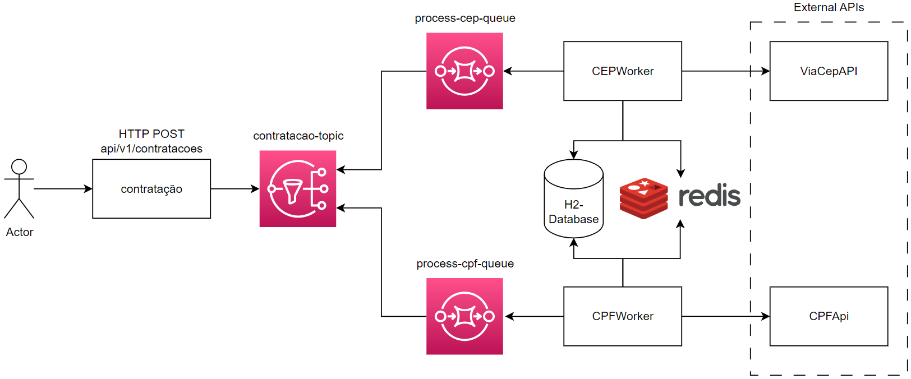
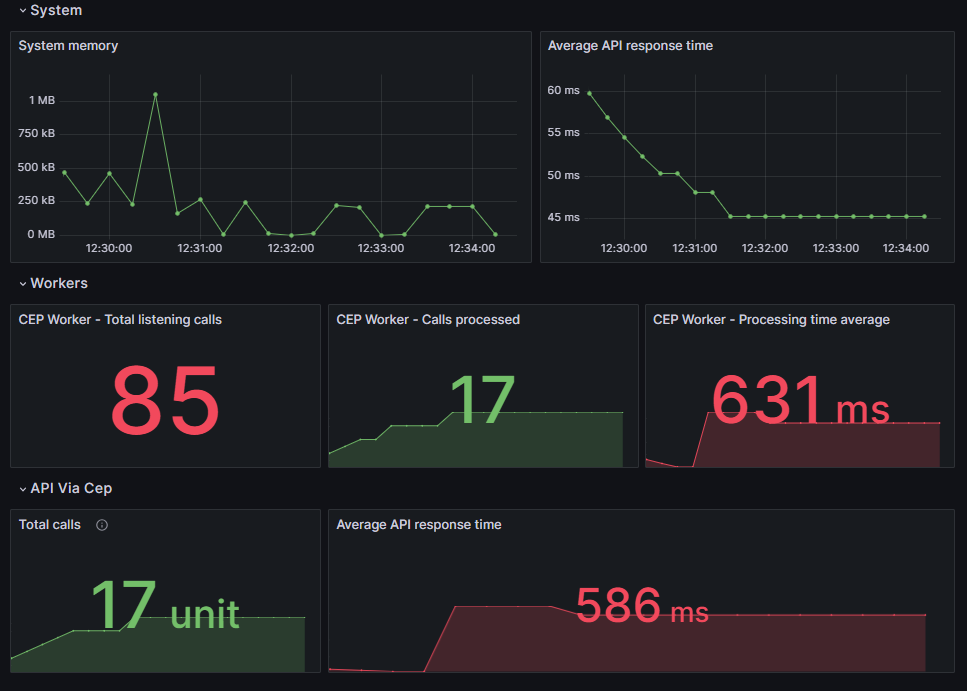

# Asynchronous AWS Messaging Project 

## Introduction
This Java project demonstrates asynchronous programming using AWS services like AWS SQS (Simple Queue Service) and AWS SNS (Simple Notification Service) along with Redis for caching. It leverages LocalStack to emulate the AWS environment locally, allowing you to test and develop without incurring any actual AWS costs.

## System Architecture


### AWS SNS
SNS is used to receive a HTTP POST request and publish the messages to a topic (contratacao-topic) that distributes messages to multiple queues (process-cep-queue, process-cpf-queue). The queues are subscribed to the topic and receive the messages asynchronously. The topic is created on Docker start up.

### AWS SQS
SQS is used to receive messages from the topic and process them asynchronously. The messages are processed by the CEPWorker and CPFWorker classes, both of which implement the Worker Interface. The queues are created on Docker start up.

### Redis Caching
Redis is used to improve performance of the application and potentially reduce costs. Before going to an external API (ViaCep), the application checks if the CEP has already been processed and cached in Redis. If it has, the application returns the cached result. If not, the application calls the external API and caches the result in Redis. 

## Observability 
I created custom metrics that help me monitor and understand the application to better optimize it. The metrics are:
- JVM Memory Usage: shows memory requirements of the application and might be helpful to determine the size of the EC2 instance
- Average API response time: shows how long it takes to response to user requests
- Workers section: helps understand how many calls are being made to SQS and of those calls how many result in a message being processed. It also monitors the average processing time of the messages (call to ViaCep API included).
- Via Cep section: monitors how many calls have been made to the external API and its average response time



The application used Spring Boot Actuator and [Prometheus](https://prometheus.io) to collect and store the metrics.
The above dashboard was created using [Grafana](https://grafana.com/).

## Running the Application

1) Run the following command to start the Docker containers:
```
docker compose up -d
```

2) Run the Java application as is most convenient for you. For example, you can run it from your IDE.


## Testing the Application
1) Execute the following script to create requests to the application:
```
# Makes HTTP requests to the application with random interval of time
./requester.sh
```
2) Check the metrics of the application [here](http://localhost:3000/d/dbb06941-1f11-4501-b8ba-2714fcc88037/home?orgId=1&refresh=15s&from=now-15m&to=now)
3) Observe the logs of the application to see the messages being processed asynchronously and eventually cached.
4) You can also check the database at http://localhost:8080/h2-console. The username is "sa" and the password is blank.
